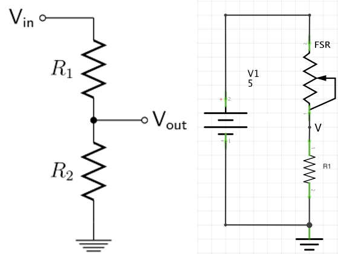
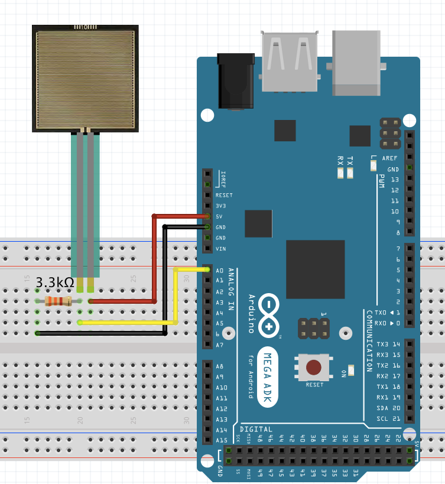
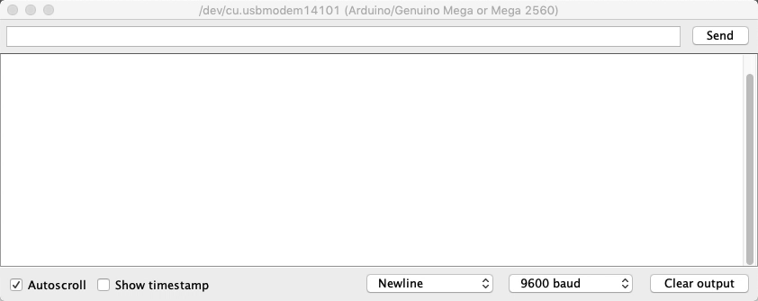

# Force Sensing Resistors (FSRs)
FSRs are a type of robust polymer thick film (PTF) that decrease in resistance with an increase of force applied to the surface of the sensor. We will be Working with the interlink FSR 406.
The interlink is part of the single zone FSRs family, with optimized force sensitivity for use in human touch control of electronic devices.

##Technical Details

* Sensitivity range from 0.1N to 100N of force;
* 0.45mm thick;
* Handles up to 10M actuations
* 10MΩ when non actuated
* Non linear Resistor, so changes of force are not linear to changes in resistance, especially in the beginning.

## Examples

### Pressure Sensor with Sampling and Basic Filtering
Lets make a pressure sensor using a voltage divider circuit and the arduino!

#### Schematic
The common way to use this transducer is with the use of a voltage divider circuit. $R_1$'s value will change the way the voltage curve(for $V_1$ ) is for different pressures (the lower the resistance,  the more low pressure values are spread out, and the curve becomes more 'stretched'), lets see a common voltage divider, and our particular case:

Here's the whole sensor system diagram:

#### Results
Let's see what the console looks like in the end:

