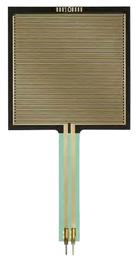

# Force Sensing Resistors (FSRs)
FSRs are a type of robust polymer thick film (PTF) that decrease in resistance with an increase of force applied to the surface of the sensor.

The interlink is part of the single zone FSRs family, with optimized force sensitivity for use in human touch control of electronic devices.

##Technical Details

* Sensitivity range from 0.1N to 100 N of force;
* 0.45mm thick;
* Handles up to 10M actuations
* 10MΩ when non actuated
* Non linear Resistor, so changes of force are not linear to changes in resistance, especially in the beginning.

## Voltage Divider

 Since the current in this circuit is shared, and every resistor 'consumes' power when current is fed to it, $V_{in}$ will be different from $V_{out}$.

## Examples
Lets make a pressure sensor using a voltage divider circuit and the arduino!

## Results
Let's see what the console looks like in the end:
