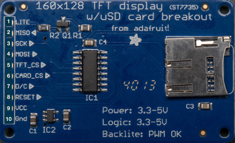

### Color TFT LCD displays

TCT LCD (Thin-film-transistor liquid-crystal display) is a variant of LCD, that uses TFT tech to improve image quality.

####1.8" Color TFT LCD display with MicroSD Card Breakout

Possessing 128 * 160 color pixels true TFT with full 18-bit color, this display can be used with any microcontroller.

There's internal logic that ensures you can use this  with 3.3 or 5v power and logic. They also have a microSD card holder for easy loading of Full Color Bitmaps, as long as the microSD is formatted with Fat16/32.

Lets start by knowing what each pin on the breakout does:

1. **Lite** - PWM input for the backlight control. Connect to 3-5VDC to turn on, to ground to turn it off or, you can PWM for intensity of the blacklight;
2. **MISO** - this is the SPI Master In - Slave Out pin, used for the SD card. It isn't used for the TFT display which is write-only;
3. **SCLK** - SPI clock input pin;
4. **MOSI** - SPI Master Out - Slave In pin, it is used to send data from the microcontroller to the SD card and/or TFT;
5. **TFT_CS** - TFT SPI chip select pin;
6. **Card_CS** - SD card chip select, used if you want to read from the SD card;
7. **D/C** - TFT SPI data or command selector pin;
8. **RST** - TFT reset pin. Connect to ground to reset the TFT! (It's best to have this pin controlled by the library so the display is reset cleanly, but you can also connect it to the Arduino Reset pin, which works for most cases) ;
9. **Vcc** - Power pin, connect to 3-5V DC - it has reverse polarity protection, however try to wire properly!
10. **GND** - Power and signal ground pi.

This color display uses SPI (Serial Peripheral Interface) to receive image data. That means you need at least 4 pins - clock, data in, TFT_CS and D/C. If you'd like to have SD card usage too, you need another 2 pins.

You will also need to install two libraries: Adafruit GFX (a graphics library), and Adafruit_ST7735 (a library for the display).
