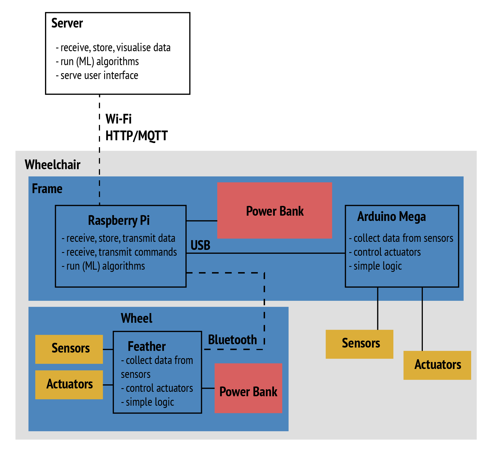

The Wheelchair Design Platform is a repository contains some resources to help
designers and developers speak the same language and work together towards
addressing relevant challenges for wheelchair users. It is a collection of 
workshop material, code examples and compilation of resources to foster a research
and design community around wheelchair users.

## Workshops

* [Getting started](/docs/workshops/GettingStarted.md)
* [Workshop 1: Building an Internet-Connected Wheelchair](/docs/workshops/Workshop1.md)
* [Workshop 2: Integrating and Visualising Sensor-Based Data](/docs/workshops/Workshop2.md)
* [Workshop 3: Developing an algorithms and Controlling Actuators](/docs/workshops/Workshop3.md)
* [Workshop 4: Developing and Conducting a Data Collection Campaign](/docs/workshops/Workshop4.md)
* [Workshop 5: Implementing a Machine Learning Pipeline](/docs/workshops/Workshop5.md)
* [Workshop 6: Developing a Product analytics Dashboard](/docs/workshops/Workshop6.md)

## Resources

* This platform uses two programming languages, Python on computers and C on
micro-controllers. While descriptions and examples of code should help you
get started, you can find some additional resources
[here](/docs/resources/software.md "Python and C resources").

* Documentation of your project is key,
[here are some tips and examples](/docs/resources/documentation.md "Documentation tips and examples").

## Main Components

__**Disclaimer:**__ the design of this platform focuses on flexibility and
technology exploration rather than optimisation.

The main design includes a Raspberry Pi and an Arduino Mega on the wheelchair frame.

The Arduino Mega is a micro-controller. Fixed on the main frame of the wheelchair,
it can collect data from sensors (e.g. forces, accelerometers) and trigger actions
(e.g. LEDs, vibration motors).

More on the Arduino Mega [here](https://github.com/datacentricdesign/wheelchair-design-platform/tree/examples/arduino "Arduino resources").

The Raspberry Pi is a small computer. Also fixed on the main frame of the wheelchair,
it can
* interact with the Arduino Mega via USB to receive data and transmit command
* interact with the Internet to receive data and transmit command
* store data locally in files;
* run (machine learning) algorithms.

More on the Raspberry Pi [here](https://github.com/datacentricdesign/wheelchair-design-platform/tree/examples/raspberrypi "Raspberry Pi resources").

These components fit together as shown on the following diagram. A large powerbank
power the Raspberry Pi. The Arduino Mega communicates and receives power from the
Raspberry Pi via USB. A Feather (Arduino-like device) on the wheel connects to
the Raspberry Pi via Bluetooth to sense and actuate from the wheel.

## List of suggested components:

On the frame:

* 1 Raspberry Pi 3B
* 1 SD card (Some come directly with NOOBS installed)
* 1 Arduino Mega
* 1 Large power bank
* 1 large breadboard
* 1 USB cable A/micro (Powerbank to Raspberry Pi)
* 1 USB cable A/B (Raspberry Pi to Arduino Mega)

On the wheel:

* 1 Feather (Bluetooth enabled)
* 1 small power bank
* 1 small breadboard
* 1 USB cable A/B (power bank to Arduino Uno)

## Contact and Existing projects

Fill free to contact us at jacky@datacentricdesign.org. We welcome feedback, pull request
 or link to your project.
