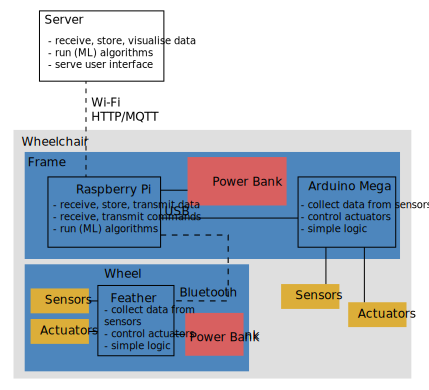

The Wheelchair Design Platform is a set of hardware and software component which facilitate the deployment of  sensing and actuating capability on a Wheelchair. It aims at supporting designer through the exploration of relevant and novel products and services around wheelchairs.

This platform uses two programming languages, Python on computers and C on micro-controllers. While descriptions and examples of code should help you get started, you can find some additional resources [here](/resources/software.md "Python and C resources").

Note: the design of this platform focus on flexibility and technology exploration rather than optimisation.

# Main Components

The main design includes a Raspberry Pi and an Arduino Mega on the wheelchair frame.

The Arduino Mega is a microcontroller. Fixed on the main frame of the wheelchair, it can collect data from sensors (e.g. forces, accelerometers) and trigger actions (e.g. LEDs, vibration motors).

More on the Arduino Mega [here](https://github.com/datacentricdesign/wheelchair-design-platform/tree/examples/arduino "Arduino resources").

The Raspberry Pi is a small computer. Also fixed on the main frame of the wheelchair, it can
* interact with the Arduino Mega via USB to receive data and transmit command
* interact with the Internet to receive data and transmit command
* store data locally in files;
* run (machine learning) algorithms.

More on the Raspberry Pi [here](https://github.com/datacentricdesign/wheelchair-design-platform/tree/examples/raspberrypi "Raspberry Pi resources").

These components fit together as shown on the following diagram. A large powerbank power the Raspberry Pi. The Arduino Mega communicates and receives power from the Raspberry Pi via USB. Two Bluetooth modules enables the Arduinos to communicate, avoiding hard connection between the wheel and the frame.

## List of components

On the frame:

* 1 Raspberry Pi
* 1 SD card
* 1 Arduino Mega
* 1 Bluetooth module HC05
* 1 Large power bank
* 1 large breadboard
* 1 USB cable A/micro (Powerbank to Raspberry Pi)
* 1 USB cable A/B (Raspberry Pi to Arduino Mega)

On the wheel:

* 1 Arduino Uno
* 1 Bluetooth module HC06
* 1 small power bank
* 1 small breadboard
* 1 USB cable A/B (power bank to Arduino Uno)

## Setting up the Arduino Mega

* Attach the Arduino Mega and breadboard to the frame

* Wire the bluetooth module

* Flash the code

## Setting up the Arduino Uno

* Attach the Arduino and breadboard to the wheel

* Wire the bluetooth module

* Flash the code

## Setting up the Raspberry Pi

* Attach the Arduino Mega and breadboard to the frame

* Setup the SD card

* Plug in the Raspberry Pi and connect via ssh