# Some Operations with Git & Github

## Git Flow

To experience the flow of Git, of updating and sharing progress, let's update the
 project documentation.

### Step 1: Edit (a) File(s)

When developing, it is common to document the project using Markdown. In Markdown,
we use '#' for titles and '*' for bullet points. More formatting can be found
[here](https://guides.github.com/features/mastering-markdown/)

Open README.md and add a title at the top of the file, for example:

```markdown
# A Noisy Wheelchair

By Jane and Joe
```


Note: A blue dot appears next to your file name README.md at the top of the page,
letting you know the changes to it are not saved. Press Command+S (or Ctrl+S) to save.

### Step 2: Stage, i.e Select File Changes

Your file appears in yellow in the left panel. It means that there are changes
in this file that are not yet tracked by Git (unstaged). Click on Git in the
bottom-right corner.

In the 'Unstaged changes', double-click on the README.md to 'stage' it, i.e.
prepare this file to track its changes. The middle tab shows you the
changes.


### Step 3: Commit, i.e Record Changes Locally

Then we add a 'Commit message' to briefly explain the nature of those changes,
e.g. 'A test of Git and Markdown'. Click on 'Commit to Master' to track the changes.
You have made one change (commit) to your local repository.


### Step 4: Push, i.e  Send Local Changes to GitHub

The final step consists in sharing this change with your peers. In the bottom-right
corner, click on 'push'. This will push your changes to the remote repository (on GitHub).

### Step 5: Fetch (or Pull), i.e Get the Latest Changes from GitHub

Other members of the group can now press 'Fetch' in the bottom-right corner to
update their local repository with the latest remote version.


## 2 Data-Centric Design Hub (Per group)

In the cloud we will use our prototyped cloud platform for designers that we call
Data-Centric Design Hub. In this cloud we use the following terms:

* Persons have a collection of Things.
* Things are physical or virtual entities with Properties.
* Properties are one-to-many dimensional data points.

In our wheelchair case, we have one Thing (the wheelchair) with properties such
as acceleration (3 values for x, y and z) or seat pressure (a value for each force
sensors on the seat).

Go to the hub manager via <a href="https://dwd.tudelft.nl/manager" target="_blank">
dwd.tudelft.nl/manager</a> and click 'Not yet an account'.

## Pull Requests

When you fork a repository to experiment/extend a project on your own, you might
run into one of the following cases:

* Case 1: You would like to see your extension merged into the original project;
* Case 2: You would like to get the latest update from your original project;

In both cases, you want to execute a pull request, i.e. asking the maintainer of
the original repository to pull code from your repository or (asking yourself) to
to pull code from the original repository.

Go to your repository on GitHub and click on 'Compare', below the green button.

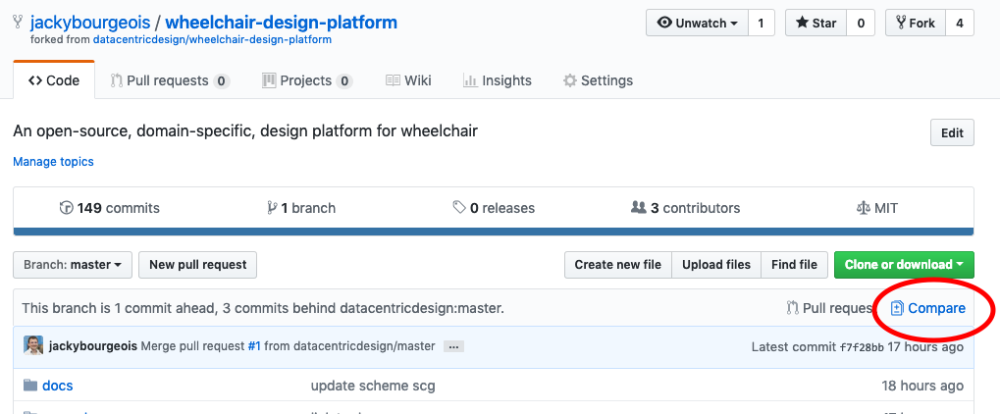

In the next step, select the source from where to pull the code (on the right)
and the destination where to push the code (on the left). If you want to catch up
with the code from the original repository (as shown below), the original repository
is the source while your repository is the destination (Case 2). Simply inverse
those if you want to share your code on the original repository (Case 1).

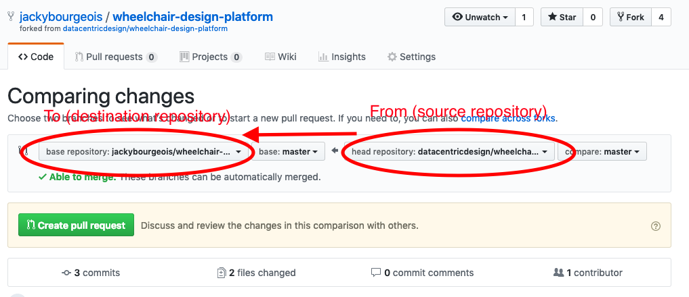

In the next step, you write a short message to explain the purpose of this pull
request. This message is more important if you want to share your code (case 1) to
motivate why the maintainer of the original repository should merge your code.

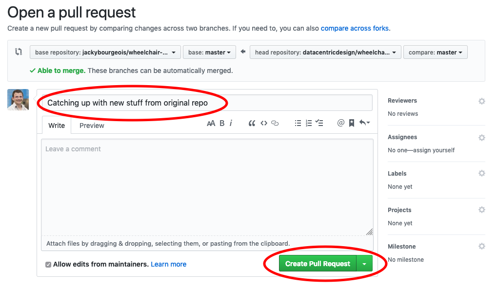

The last stage is about accepting the pull request. In case 2, you are the one
clicking on 'Merge pull request' (as shown below). In case 1, the maintainer of
the original repository receive a message to accept or reject the pull request.

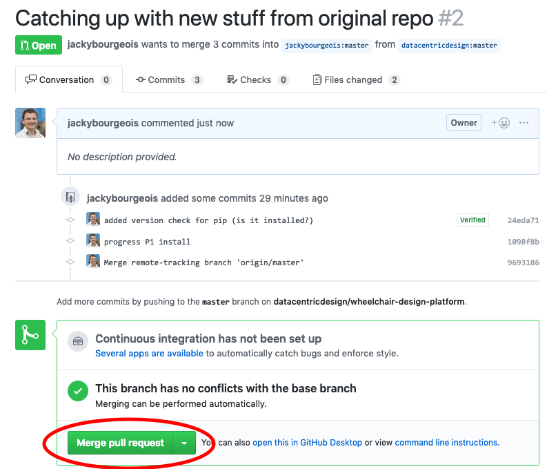

## Issue Tracking and Flagging
Whenever there is a problem with the code in the repository, it is customary to raise an issue in Github. This will not only allow other contributors to verify this error, but also for them to possibly fix them, and then, tag them as fixed. We will also use this workflow when there is a problem with the code and you want to get some non-presential help from the course instructors.

### Issue basics
Once again, this workflow is available on the Github website.
Let's begin by going to the _Issues_ tab of your repository:

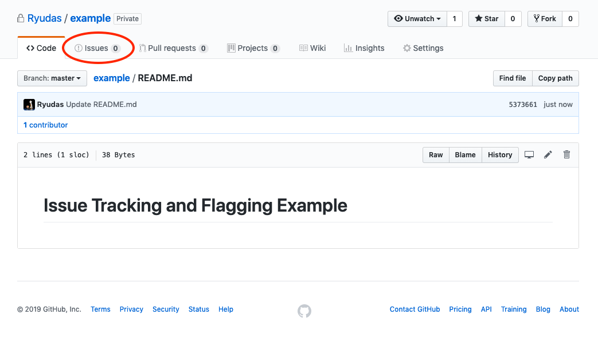

Once we're in this tab, we can see the different options available to us:

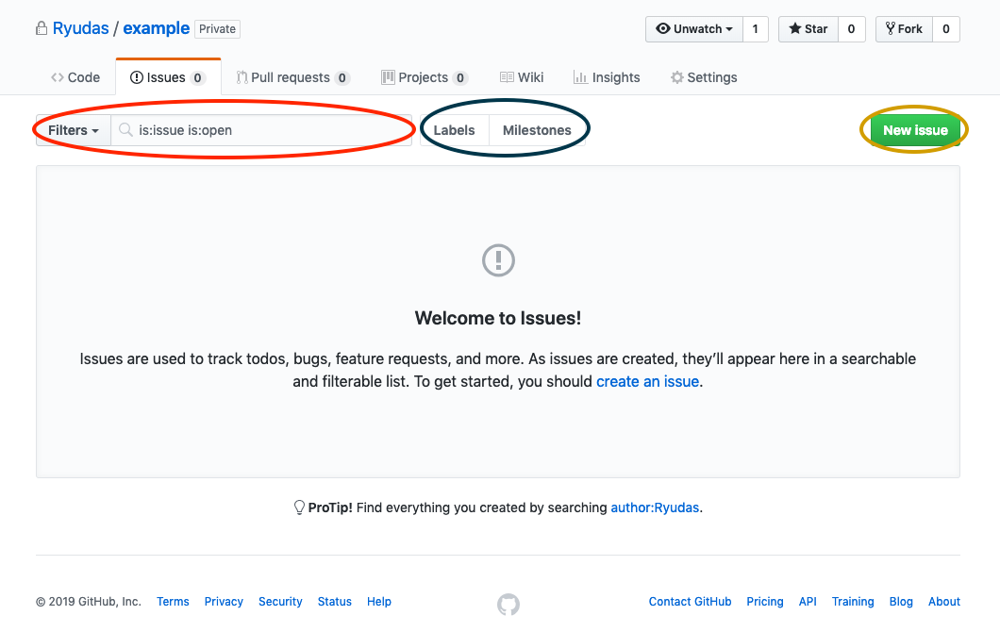

* In red, is the search box, where we can search for issues, with or without filters (by default, we'll search only open issues);
* In blue, we can find the label and Milestones subtabs (we'll go into more detail on this later);
* In yellow, we find the button for creating new issues in the repo.

### Labels and Milestones
Github provides these extra organizational tools so the repository can be more efficient. Issues are used for general things to keep in mind for the project collaborators, such as bugs, needed features, etc.
#### Labels


We use labels to be able to compartmentalize these different types of Issues in an efficient manner. This way, we can see easily the type of any issue. By default your repository has some predefined labels, but we can create our own:

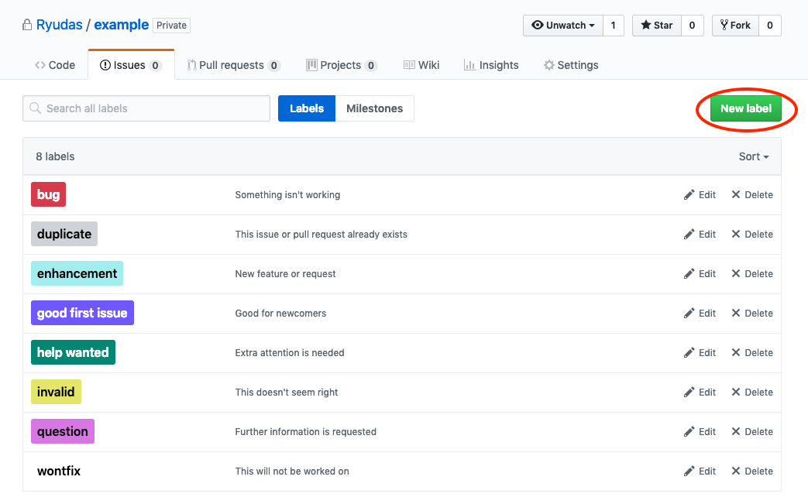

In the label tab, we can create a new one by using the _New Label_ button circled in red. After clicking, we'll see a wizard, where we can name the new label, give it a description, and choose a color (pressing the refresh button will randomly generate one).


After creating the label by pressing the button circled in red, we should see it now in the labels subtab:


#### Milestones
Milestones are a tool to help with organizing big levels in your project. It is customary to create these _Milestones_, and fill them with issues that need to be accomplished/solved to reach the Milestone.

Any contributor can then open the milestone, and assign themselves to solve a particular issue in it, create more issues, or comment on the ones already there. As the Milestone issues are closed (we will talk more on this later), Github will provide a progress bar for that particular milestone.

You can create a milestone, by going to the milestones tab, and clicking the button circled in red:
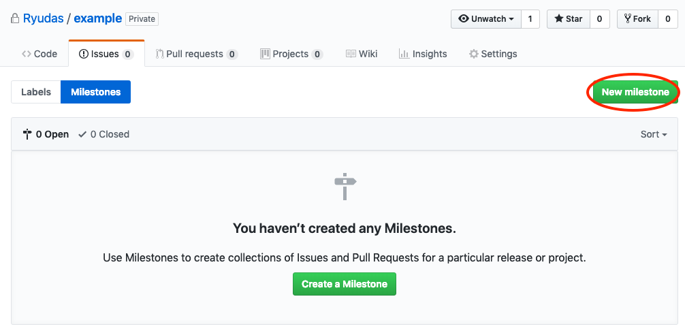

And then completing the wizard that shows up. After that your Milestone should appear in the Milestone tab:


After this you can create the issues (more on this later) necessary for the completion of the Milestone. As these issues are closed, you can see the progress of the Milestone:


### Issues
Issues are set in a repo (repository) for all kinds of different reasons. They can be just reminders of what needs to be done in a Milestone, they can be bugs found in code, aswell as feature requests for the repo, among others. Once an Issue is created, it is flagged as "open". Once it is solved, will be flagged as closed.

#### Creating and Closing Issues in your repo
We can create an issue in the general _Issue_ tab, or inside a milestone (however general issues can be attributed to a milestone, so the second option is only there for convenience).

Since we can make a general issue part of a milestone, we will create a general one, by clicking the button circled in red:

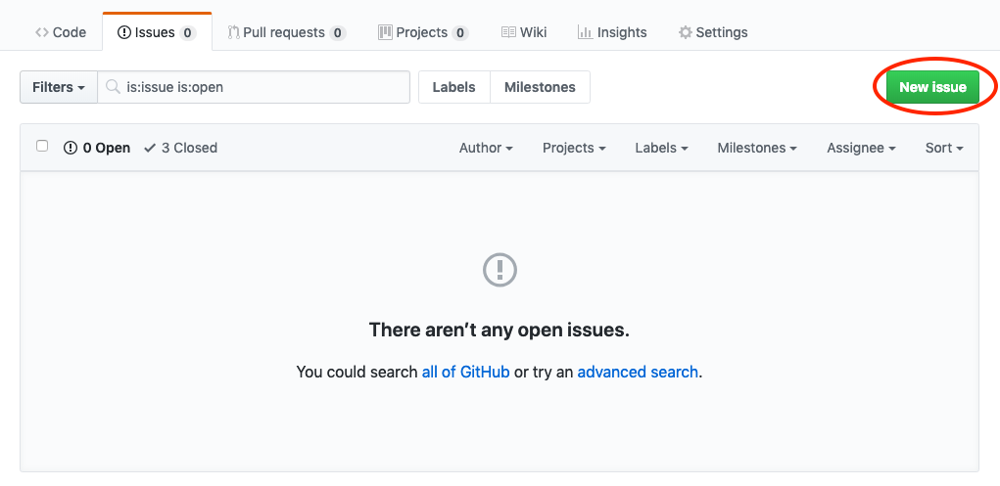

In the following wizard, you can add a title and description to the issue, assign it to collaborators, give it one or more labels, and make it part of a Milestone (you can do this with the gear icons).

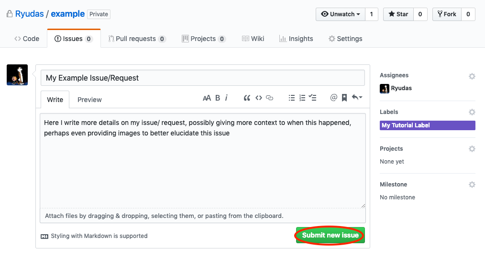
You can then submit it with the button circled in red. Afterwards, your new issue should appear in your _Issues_ tab as an open issue. contributors and people who have access to the repo can open these Issues, and then comment on them:

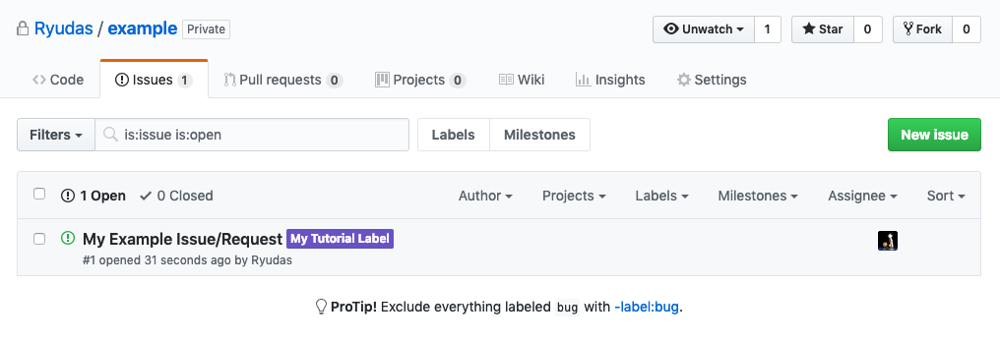

After a contributor to the project has implemented/fixed an issue of the repo, they can close it. In Github, you can do this by opening an open issue, and choosing the button circled in red. You can also comment, perhaps to explain  why/how you closed it or what you did:

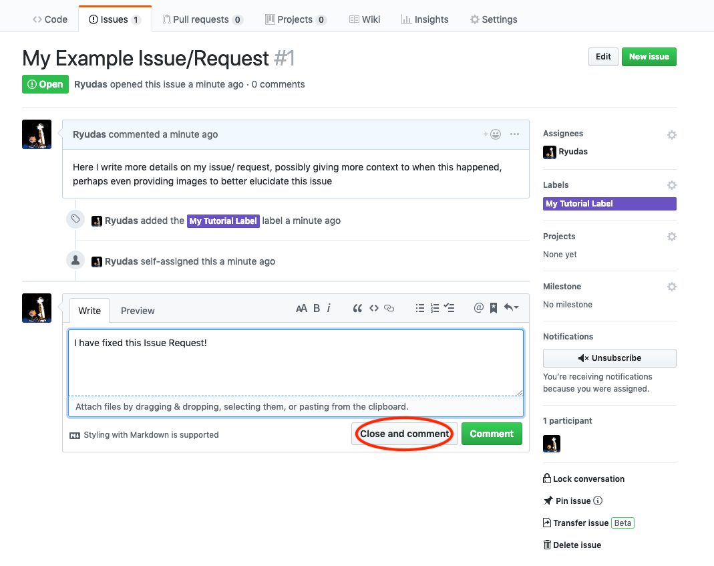


We are now prepared to use Github as an efficient platform for collaboration!
