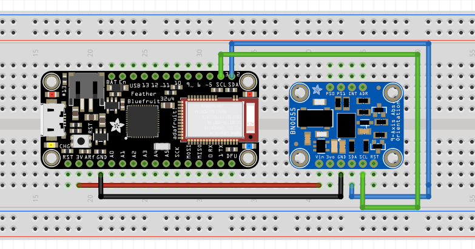

# Workshop 2: Integrating and Visualising Sensor-Based Data

1. [Orientation Sensor](#1-orientation-sensors)
2. [Feather Bluefruit](#2-feather-bluefruit)
3. [Bluetooth Low Energy (BLE) GATT Service](#3-bluetooth-low-energy-ble-gatt-service)
4. [Local Pre-Processing](#4-local-pre-processing)


## 1 Orientation Sensors

To get started with this second workshop, we propose to experience the principles
 and the capabilities of an orientation sensors. Go through the explanation and
 the examples we compiled for the BNO055: [Orientation Sensor](/resources/sensors/orientation)

## 2 Feather Bluefruit

With a better understanding of the BNO055, we can now apply these example on our
wheelchair to monitor the various movement of the wheel. As this part of the wheelchair
is mobile, we need a wireless connection to transmit information.

At this stage, there are three potential strategy:
1. Sending data directly to the cloud, via LoRa, 4G or WiFi;
2. Sending data to the Arduino Mega by setting up a Personal Area Network (PAN), 
e.g. Bluetooth, Zwave, Zigbee.
3. Sending data to the Raspberry via WiFi or Bluetooth (Wireless capabilities of the Pi).

In this workshop we choose the third option, sending data to the Raspberry Pi via
Bluetooth. This strategy avoid implementing Bluetooth on the Arduino Mega, leveraging
the Raspberry Pi capabilities. We  also centralise the data before sending them
to the cloud, offering more flexibility.

On the wheel, we propose to implement the Feather 32u4, an Arduino-like, Bluetooth
enabled board by AdaFruit. Have a look at the documentation we compiled to get 
an overview of its capabilities and set up your Arduino IDE: [Feather 32u4](/resources/feather)

## 3 Bluetooth Low Energy (BLE) GATT Service

As described in its resource page, the Feather 32u4 has a Bluetooth Low Energy (BLE)
communication capability. To communicate over BLE, we choose the GATT specification 
(standing for Generic ATTribute Profile). It is implemented by most Bluetooth 
consumer product and will enable our prototype to easily fit in its technology
landscape.

### 3.1 Exploring the Heart Rate Measurement (HRM) GATT Service

Let's run the example of GATT service Heart Rate Measurement (HRM) provided by Adafruit.
It is used by FitBits and alike to send HRM data to your phone.

Back to Arduino IDE, in the top menu select File > Examples > Adafruit BluefruitLE nRF51 > heartratemonitor.

In line 111, change the name 'Bluefruit HRM' to the name of your choice. This will
be the name of your device on the network.

Flash the code on the the Feather 32u4 and open the Serial monitor to observe
the initialisation process.

On your phone, search for 'ble gatt' in the app store and install 'nRF Connect'.
Open the app and scan for devices. The name you gave to your Feather 32u4 should
appear in the list. Click 'Connect' to connect on your Feather 32u4. The list of 
GATT services should appear, including the Heart Rate Measurement. Click to open
this service and list its characteristic. Click on the triple arrow down to subscribe
to the Heart Rate Measurement characteristic. You should see the (random) heart
rate value sent by your Feather 32u4 every seconds.


### 3.2 Orientation data as GATT Service

Like most connected devices, the Feather rely on the 
<a href="https://en.wikipedia.org/wiki/Hayes_command_set" target="_blank">Hayes commands</a>
to communicate over Bluetooth. These commands start with 'AT+'.

To implement a GATT service, the Feather 32u4 as a set of 
<a href="https://learn.adafruit.com/introducing-adafruit-ble-bluetooth-low-energy-friend/ble-gatt" target="_blank">AT commands available</a>.
We will walk you through them as we transform the HRM example into an Orientation
GATT service.


The complete source code is available in 
<a href="https://github.com/datacentricdesign/wheelchair-design-platform/tree/master/examples/communication/bluetooth/bno055_gatt" target="_blank">examples / 
communication / bluetooth / bno055_gatt</a>

### 3.3 Wire and set up on the Wheel

We can see a simple wiring example using this board, together with an IMU (in our
case the BNO055):



Flash the code on the Feather 32u4 and connect to your orientation service from
your phone.

Set up the power bank and the breadboard on the wheel.

## 4 Python

The next step is to subscribe to the GATT service from the Raspberry Pi and push
the received data on the DCD Hub.

Let's connect to the Raspberry Pi and install the Bluetooth dependencies for Python.
Once logged on the Raspberry Pi, type in the following commands to install BLE dependencies.

```bash
sudo apt-get install bluez libbluetooth-dev

sudo pip3 install git+https://github.com/peplin/pygatt

sudo pip3 install "pygatt[GATTTOOL]"
```

We can use the command 'blescan' to scan the Bluetooth devices around. This way,
you can retrieve and copy the MAC address of your Feather 32u4.

```bash
sudo blescan
```


## 5 Local Pre-Processing

Algorithm for counting rotation

Adding service counting rotation