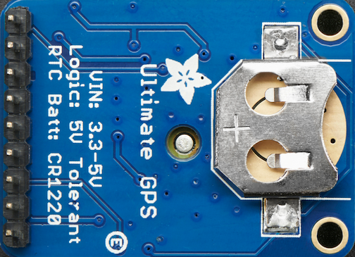
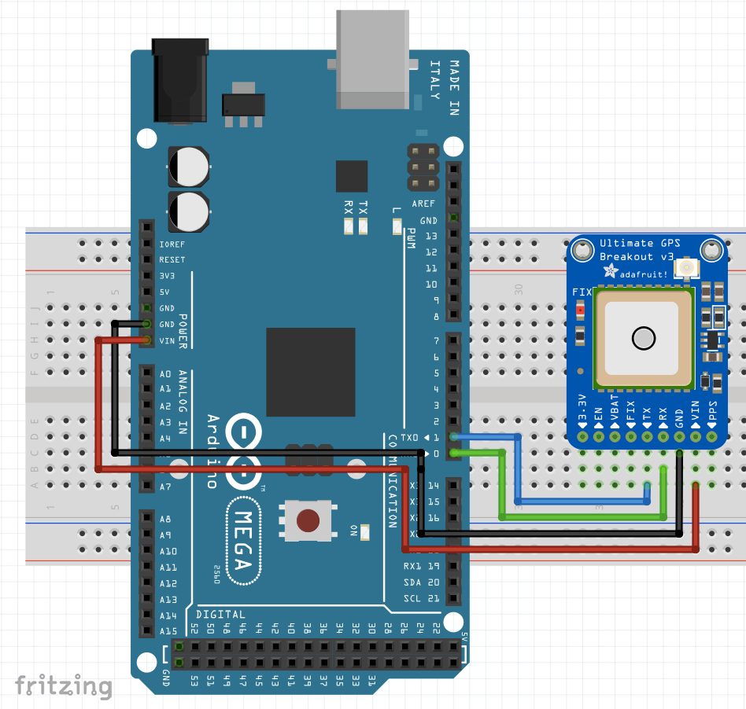
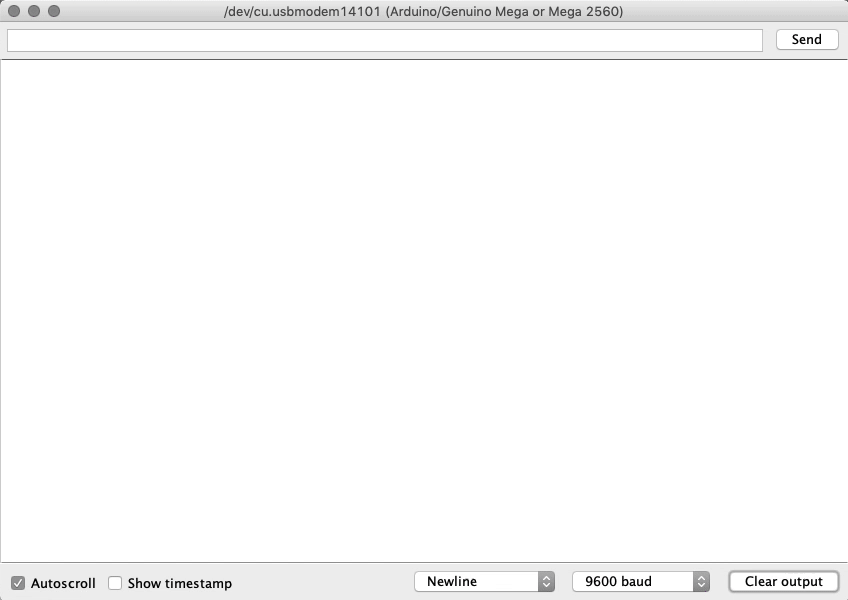
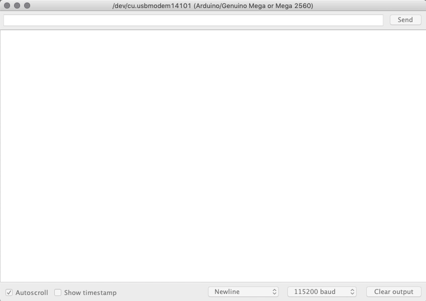

# GPS Positional Sensors
GPS (Global Positioning System) is a global satellite-based radio navigation system, composed of a satellite system that provides geolocation and time information to a GPS receiver anywhere on or near the Earth where there is an unobstructed line of sight to four or more GPS satellites. These signals are relatively weak, and obstacles such as Buildings or mountains can block them.

GPS does not require the user to transmit any data, and it operates independently of any telephonic or internet reception, though these technologies can enhance the usefulness of the GPS positioning information.

## Adafruit Ultimate GPS Breakout v3

This breakout is built around the MTK3339 chipset, a high-quality GPS module that can track up to 22 satellites on 66 channels, has an high-sensitivity receiver (-165 dBm tracking), and a built-in antenna. It can do up to 10 location updates a second for high speed, high sensitivity logging or tracking. Power usage is low, at around 20mA during navigation.

### Pins
1. **3.3v** - Clean 3.3V output from internal voltage regulator, supplies at least 100mA, if needed;
2. **EN** -  Enable pin, has a 10K pull up resistor. When this pin is pulled to ground, it will turn off the GPS module. Handy for very low power projects where you want to easily turn the module off for long periods. You will lose your fix if you disable the GPS and it will also take a long time to get fix back if you don't have the backup battery installed;
3. **VBAT** - Input pin, connected to the GPS real time clock battery backup. Using the battery spot on the back is suggested, but if you have a project with a coin cell or another kind of battery that you want to use (and its under 3.3V) you can connect it to the VBAT pin;
4. **FIX** - Output pin, same pin as the one that drives the red LED. When there is no fix, the FIX pin pulses up and down once every second. When there is a fix, the pin is low (0V) for most of the time, and once every 15 seconds it will pulse high for 200 milliseconds;
5. **TX** - Serial data pin, that transmits data from the GPS module to your microcontroller/computer. It uses 3.3V logic levels. Data comes out at 9600 baud by default;
6. **RX** - Serial data pin used to send data to the GPS. Can be used with 3.3V or 5V logic, there is a logic level shifter. By default it expects 9600 baud data, which has to be sent to it checksum'med with NMEA (combined electrical and data specification for communication between marine electronics such as echo sounder, sonars, anemometer, gyrocompass, autopilot, GPS receivers a) sentences;
7. **Gnd** - common power and signal ground;
8. **Vin** - Power input, to be connected to 3-5VDC. GPS's are very sensitive, so is important to have a nice and quiet power supply. Don't connect to a switching supply if you can avoid it, also, an LDO (Low-dropout regulator) will be less noisy;
9. **PPS** - Output pin. It is a "pulse per second" type of output. Most of the time it is at logic low (ground) and then it pulses high (3.3V) once a second, for 50-100ms, so it should be easy for a microcontroller to sync up to it.

### Technical Details
The data logging of this GPS module functions like this:
The time, date, longitude, latitude, and height is logged every 15 seconds and only when there is a fix. The internal FLASH can store about 16 hours of data, and it will automatically append data so you don't have to worry about accidentally losing data if power is lost. It is not possible to change what is logged and how often, as its hardcoded into the module, but this arrangement covers many of the most common GPS data logging requirements.

* 1-10 Hz update rate;
* Tracking of up to 22 satellites on 66 channels;
* Position Accuracy of 1.8 meters;
* Velocity Accuracy of 0.1 meters/s;
* Warm/cold start up time of 34 seconds;
* Acquisition sensitivity of -145 dBm;
* Tracking sensitivity of -165 dBm;
* Maximum Velocity of 515m/s;
* Operating current of 25mA when tracking, 20 mA current draw during navigation;
* Outputs NMEA 0183, 9600 baud (default);
* DGPS (differential global positioning system)/WAAS (Wide Area Augmentation System)/EGNOS (European Geostationary Navigation Overlay Service) support;
* Up to 210 PRN (pseudorandom noise number) channels (used to identify satellites);
* Jammer detection and reduction;
* Multi-path detection and compensation;
* RTC battery-compatible;
* Built-in data logging, only requires microcontroller to send the "Start Logging" command, after that, it can go to sleep and does not need to wake up to talk to the GPS anymore;
* PPS output on fix;
* Internal patch antenna + u.FL connector for external active antenna (module will automatically detect the active antenna and switch over);
* Fix status LED;

#### Battery Backup
This breakout has a built in real time clock (RTC), which can keep track of time even when it power is lost and it doesn't have a fix yet. It can also help reduce fix times, if you expect to have an unreliable power connection(like solar, for example). To use the RTC, we need to attach a battery. There is a spot on the back for a CR1220 sized battery holder. You can use any 12mm coin cell - these are a popular and common form factor:

Once the GPS loses power, it will revert to the factory default for baud rates, configuration, etc. A backup battery will prevent that!

The backup real-time-clock circuitry draws 7 uA (0.007 mA) so a CR1220 will last 40mAh / 0.007mA = 5,714 hours = 240 days continuously. The backup battery is only used when there's no main 3V power to the GPS, so as long as it's only used as backup once in a while, it can last years.

### Examples

#### Output Raw GPS Serial data, bypassing Arduino.

GPS modules will start 'spitting' data, and trying to get a 'fix' (location verification) the moment you turn them on. Like most other GPS modules, the Adafruit Ultimate GPS uses TTL serial output to send data.

Knowing this, a good way to test it is to wire it directly to the computer via the TTL serial to USB converter on an Arduino(RX and TX pins). You can also use an FTDI Friend or another TTL adapter.

##### Schematic

For this example, we'll just flash the Arduino with an empty sketch, turn on the Serial monitor (please select to 9600 baud on the serial monitor window), and watch the GPS "NMEA sentence" output from the module data come in.

##### Results
Let's see our console output:

**Note** that the data you receive is separated by commas. If you get empty values between the commas, that means that the module doesn't have a fix, and the red LED should be blinking. To get a fix, you should have the module pointed towards the sky uninterrupted for some time, out of a window or preferably outside.

The most common sentences people use are the GPRMC (Global Positioning Recommended Minimum Coordinates) and the GPGGA sentences.

These provide the time, date, latitude, longitude, altitude, estimated land speed, and fix type. Fix type indicates whether the GPS has locked onto the satellite data and received enough data to determine the location (2D fix) or location+altitude (3D fix).

Click this to expand an explanation of the GPRMC sentence.

This line is called the RMC (Recommended Minimum) sentence and it has the most useful data. Each chunk of data is separated by a comma.

* The first part is the current time in GMT (Greenwich Mean Time). The first two numbers indicate the hour, the next two are the minutes, then the next two are the seconds. Finally, we have the milliseconds;

* The second part is the 'status code', if it is a V that means the data is Void (invalid). If it is an A that means its Active (the GPS could get a lock/fix);

* The next 4 pieces of data are the geolocation data.
To look at this location in Google maps,  it requires you to use +/- instead of N-S W-E notation. N and E are positive, S and W are negative.
The geolocation data is in degrees and minutes in the following format: Latitude: DDMM.MMMM (The first two characters are the degrees) Longitude: DDDMM.MMMM (The first three characters are the degrees);

* The next data field is the ground speed in knots;

* The next data point is the tracking angle, this is meant to approximate what 'compass' direction we're heading at based on our past travel;

* The one after that is 160412 which is the current date (DDMMYY);

* At the end, there is the \*XX data which is used as a data transfer checksum (for transfer error debugging).

#### Echoing Raw GPS Data with the Arduino

In this example, we will echo the raw GPS data using the Arduino. For this the installation of the Adafruit GPS library is required.
Be very careful in respect to the schematic, as in this case, you'll be connecting **TX** from the GPS breakout to the corresponding **RXx** port of the Arduino. In this particular example,  RX(GPS) -> TX1(Mega)) & TX(GPS) -> RX1(mega). Be sure to set the Serial console's window baud rate to 115200.

##### Schematic

##### Results
Let's see our console output:

#### Parsing GPS Data with the Arduino

This time we will parse the data using the Arduino. For this the installation of the Adafruit GPS library is required.
Be very careful in respect to the schematic, as in this case, you'll be connecting **TX** from the GPS breakout to the corresponding **RXx** port of the Arduino. In this particular example,  RX(GPS) -> TX1(Mega)) & TX(GPS) -> RX1(mega). Be sure to set the Serial console's window baud rate to 115200.

##### Schematic

##### Results
Let's see our console output:

